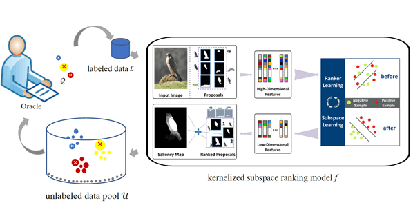

# KSR-AL
</br>
This repository has released the codes and saliency maps of 'Visual Saliency Detection via Kernelized Subspace Ranking with Active Learning', IEEE TIP 2019,
by Lihe Zhang, Jiayu Sun, Tiantian Wang, Yifan Min and Huchuan Lu.
[PDF(baidu)](https://pan.baidu.com/s/1NWWSao3ZA7LevIFtSW3HbQ)
[PDF(google)](https://drive.google.com/file/d/1hHvxiSiKo_5UXWllwqawuMg3kZ3fAtJU/view?usp=sharing)

# Download
The saliency maps on 7 datasets including ECSSD, PASCAL-S, SOD, DUT-OMRON, HKU-IS, THUR15K and DUTS can be found in the following links.

- [Google Drive](https://drive.google.com/drive/folders/1v5BlGGg_2EuPhw_boPZ2jSCEPY4l84yn?usp=sharing)
- [Baidu Drive](https://pan.baidu.com/s/1gGBHNNoCIVV3LNXxiIHvpw)

# Citation
If this method is useful in your research, please cite the above publication: Bibtex entry:
```
@ARTICLE{ZhangTIP19, 
author={L. {Zhang} and J. {Sun} and T. {Wang} and Y. {Min} and H. {Lu}},
journal={IEEE Transactions on Image Processing}, 
title={Visual Saliency Detection via Kernelized Subspace Ranking with Active Learning}, 
year={2019}, 
pages={1-1}, 
doi={10.1109/TIP.2019.2945679}, }
}  
```

# Contact

If you have any questions, please send email to jiayusun666@gmail.com.
